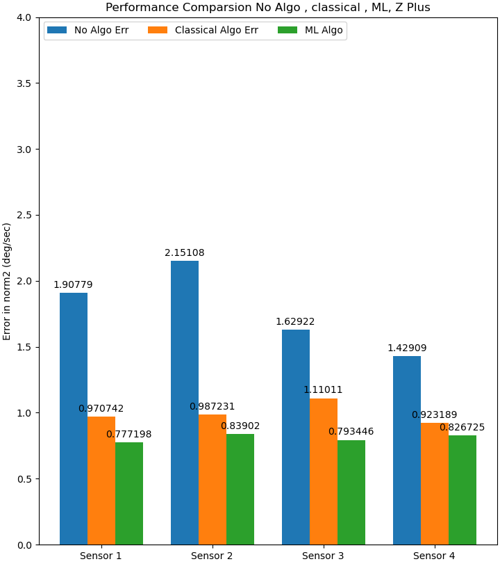

# Table of Contents

1.  [Caliberation Gyro](#org8b4cef8)
    1.  [Introduction](#org0590ef9)
    2.  [Classical Least Square](#org824c329)
2.  [Examples](#orgc54e64a)
3.  [Instructions](#org59330f7)
4.  [Progress Bar <code>[3/3]</code>](#org745a127)
5.  [Big Problem other axis](#org4d12913)

# Caliberation Gyro

## Introduction

In this repo we&rsquo;ll compare between Caliberation method
The following algorithms are currently supported

-   No Algo
-   Classic Least Square Solution
-   Machine learning methods

## Classical Least Square

Our model of errors is

$$
\tilde{f} = (I_3+S_a+M_a)f+b_a+w_a 
$$
Where
$
S_a\in diag_{3\times 3}\mathbb{R}$
and 
$
M_a\in AntiSymm_{3\times 3}\mathbb{R}
$
and
$
b_a\in \mathbb{R}^3
$

Note the following derivation

$$
\tilde{f}-f = (S_a+M_a)f+b_a
$$

Concating the following matrices would generate the following matrix 

\\[
M3&times; 4=
\left[

\begin{array}{c | c}
M_a+S_a & b_a
\end{array}

\right]
\\]

Given that $ M_{3\times 4} $ matrix we can simplify equation [6](#org15c690c) to be

\\[
~{f} - f3&times; 1  = M3&times; 4

\begin{pmatrix}
f_{3\times 1 } \\ 1 
\end{pmatrix}

\\]

For example, Estimating left column of M with down x direction measurements

\\[
~{f}downx-

\begin{pmatrix}
-g \\ 0 \\ 0 
\end{pmatrix} = M
\begin{pmatrix}
-g \\ 0 \\ 0 \\ 1
\end{pmatrix}

\\]

We can concate all the vector equations together and we&rsquo;ll infer the following matrix equation

\\[

\begin{pmatrix}
\tilde{f}_{down}^{x} & \tilde{f}_{x}^{up} & \cdots & \tilde{f}_{up}^{z} 
\end{pmatrix}

-   

\begin{pmatrix}
-g & g  & 0 & 0 & 0 &   0 \\
0 & 0 & -g & g & 0  & 0 \\
0 & 0 & 0 & 0  & -g & g
\end{pmatrix}

=M

\begin{pmatrix}
-g & g  &  0 & 0 & 0 & 0 \\ 
0 & 0  &  -g & g & 0  & 0 \\ 
0 & 0  &  0 & 0 & -g  & g \\ 
1 & 1 &  1 & 1 & 1 &1 \\ 
\end{pmatrix}

\\]

I&rsquo;ll denote the matrix $ A \in \mathbb{R}^{4\times 6 }$ like so 

$$
A_{4\times 6}=\begin{pmatrix}
-g & g  &  0 & 0 & 0 & 0 \\ 
0 & 0  &  -g & g & 0  & 0 \\ 
0 & 0  &  0 & 0 & -g  & g \\ 
1 & 1 &  1 & 1 & 1 &1 \\ 
\end{pmatrix}
$$

and

$$
z_{3\times 6}=M_{3\times 4 }A_{4\times 6}
$$

$$
z_{3\times 6}A^{T}(AA^{T})^{-1}=M_{3\times 4 }A_{4\times 6}A^{T}(AA^{T})^{-1}
$$

$$
z_{3\times 6}A^{T}(AA^{T})^{-1}=M_{3\times 4 }
$$

Equation [27](#orga16e22c) gives us the best $M$ matrix for a given measurement
so our estimator is an **Unbiased estimator**, so for simple calculation we&rsquo;ll have

$$
\hat{M}=\frac{1}{n}\sum_{i=1}^{n}M = \frac{1}{n}\sum_{i=1}^{n}z_{3\times 6}A^{T}(AA^{T})^{-1}
$$

The Classical Caliberation method uses the formula from the lectures

# Examples

We want something like this photo

# Instructions

For running the algorithms

    python automate.py

The same result can be achieved even easily with 

    python simple_api.py

# Progress Bar <code>[3/3]</code>

Here are the Agenda to do 

-   [X] No Algo
-   [X] Classical Least Square
-   [X] Machine learning method

# Big Problem other axis

